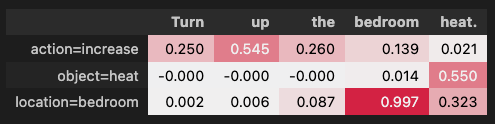
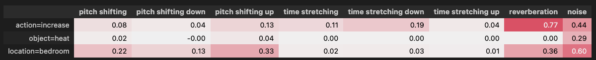
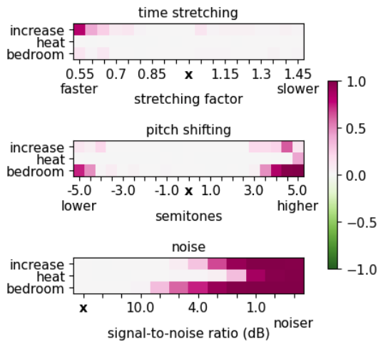

# SpeechXAI 

[](https://aclanthology.org/2024.eacl-long.136/)

This repository contains the code for the paper ["Explaining Speech Classification Models via Word-Level Audio Segments and Paralinguistic Features"](https://aclanthology.org/2024.eacl-long.136/), accepted at the 18th Conference of the European Chapter of the Association for Computational Linguistics (EACL) 2024, long paper.  

We propose a novel approach to explain speech classification models 🗣️💬

We provide two types of insights. 🚀

(i) Word-level. We measure the impact of each audio segment aligned with a word on the outcome. 

(ii) Paralinguistic. We evaluate how non-linguistic features (e.g., prosody and background noise) affect the outcome if perturbed.


## How-to  

The code below provides a minimal example on how to generate word-level audio segment and paralinguistic attributions.

We start by loading the model to explain
```python
from transformers import Wav2Vec2ForSequenceClassification, Wav2Vec2FeatureExtractor

model = Wav2Vec2ForSequenceClassification.from_pretrained("superb/wav2vec2-base-superb-ic")
feature_extractor = Wav2Vec2FeatureExtractor.from_pretrained("superbwav2vec2-base-superb-ic")
```

#### Generate attributions 

We generate explanations by simply specify the path of the audio to explain.

Here we derive word-level audio segment explanation via the leave-one-out technique:
```python
from speechxai import Benchmark

benchmark = Benchmark(model, feature_extractor)

explanation = benchmark.explain(
    audio_path=audio_path, 
    methodology='LOO')

display(benchmark.show_table(explanation, decimals=3)),
```



Here we derive paralinguistic attributions
```python
paraling_expl = benchmark.explain(
        audio_path=audio_path,
        methodology='perturb_paraling',
        )

display(benchmark.show_table(paraling_expl, decimals=2));
```


We can also plot the impact on the prediction probability when varying the degree of perturbations of the paralinguistic features:
```python

variations_table = benchmark.explain_variations(
        audio_path=audio_path,
        perturbation_types=['time stretching', 'pitch shifting', 'reverberation'])

benchmark.plot_variations(variations_table, show_diff = True);
```



#### Evaluate 

We can evaluate the faithfulness of our word-level segment explanation in terms of comprehensiveness and sufficiency:

``` python

from speechxai import AOPC_Comprehensiveness_Evaluation_Speech, AOPC_Sufficiency_Evaluation_Speech

aopc_compr = AOPC_Comprehensiveness_Evaluation_Speech(benchmark.model_helper)
evaluation_output_c = aopc_compr.compute_evaluation(explanation)

aopc_suff = AOPC_Sufficiency_Evaluation_Speech(benchmark.model_helper)
evaluation_output_s = aopc_suff.compute_evaluation(explanation)
```

## Citation
If you use this code in your research, please cite our paper:

```bibtex
@inproceedings{pastor-etal-2024-explaining,
    title = "Explaining Speech Classification Models via Word-Level Audio Segments and Paralinguistic Features",
    author = "Pastor, Eliana  and
      Koudounas, Alkis  and
      Attanasio, Giuseppe  and
      Hovy, Dirk  and
      Baralis, Elena",
    editor = "Graham, Yvette  and
      Purver, Matthew",
    booktitle = "Proceedings of the 18th Conference of the European Chapter of the Association for Computational Linguistics (Volume 1: Long Papers)",
    month = mar,
    year = "2024",
    address = "St. Julian{'}s, Malta",
    publisher = "Association for Computational Linguistics",
    url = "https://aclanthology.org/2024.eacl-long.136",
    pages = "2221--2238",
    abstract = "Predictive models make mistakes and have biases. To combat both, we need to understand their predictions.Explainable AI (XAI) provides insights into models for vision, language, and tabular data. However, only a few approaches exist for speech classification models. Previous works focus on a selection of spoken language understanding (SLU) tasks, and most users find their explanations challenging to interpret.We propose a novel approach to explain speech classification models. It provides two types of insights. (i) Word-level. We measure the impact of each audio segment aligned with a word on the outcome. (ii) Paralinguistic. We evaluate how non-linguistic features (e.g., prosody and background noise) affect the outcome if perturbed.We validate our approach by explaining two state-of-the-art SLU models on two tasks in English and Italian. We test their plausibility with human subject ratings. Our results show that the explanations correctly represent the model{'}s inner workings and are plausible to humans.",
    }
```

## Contact
For any questions, please contact [Eliana Pastor](mailto:eliana.pastor@polito.it).
